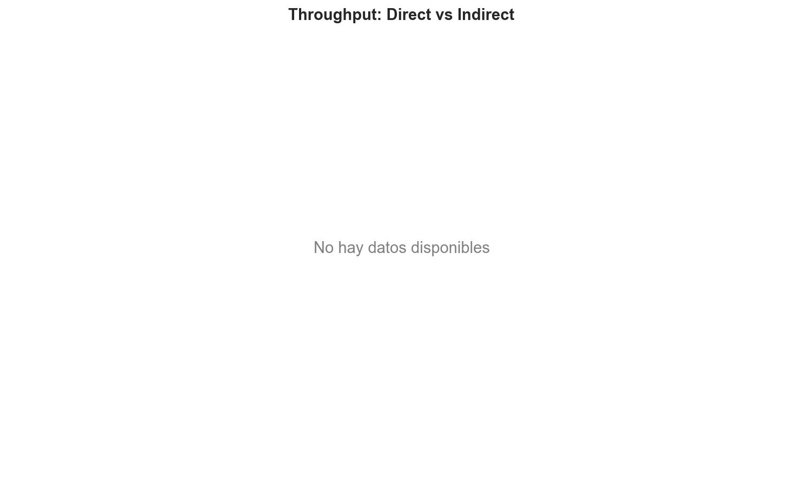
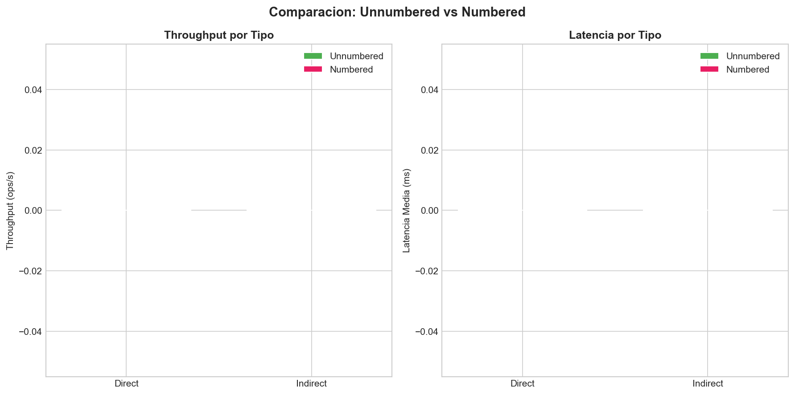

# Benchmark Comparison Report

> Generado: 2026-04-06 19:38:42 UTC

## Executive Summary

### Key Findings

- No comparative throughput data available.
- **0** benchmark scenarios evaluated.

### Recommendations

- Run benchmarks to generate comparative data and recommendations.
## Methodology

### Test Setup

- **System**: Concert Ticketing System (20,000 tickets default)
- **Architectures**: Direct (REST + NGINX) and Indirect (RabbitMQ + Workers)
- **Persistence**: Redis
- **Benchmark Tool**: Custom async HTTP benchmark runner (httpx)

### Workloads

| Workload | Description | Operations |
|----------|-------------|------------|
| Unnumbered | General admission tickets | 20,000 |
| Numbered | Specific seat purchases | 60,000 |
| Hotspot | High contention (80% to 5% of seats) | Variable |

### Configuration

- **Concurrency**: 50 concurrent requests (configurable)
- **Timeout**: 60 seconds per request
- **Workers tested**: 1, 2, 4, 8

## Direct Architecture Results

## Indirect Architecture Results

## Comparative Analysis

### Direct vs Indirect

| Benchmark | Direct Throughput | Indirect Throughput | Ratio | Direct Latency | Indirect Latency |
|-----------|------------------|--------------------|---------|-----------------|--------------------|

## Plots

### Throughput Comparison

### Ticket Type Comparison

### Success Failure Breakdown

## Conclusions

### Tradeoffs

- **Direct Architecture**: Lower latency, simpler deployment, but tightly coupled.
- **Indirect Architecture**: Better fault tolerance, decoupled components, but higher latency.

### Best Use Cases

- **Direct**: Low-latency requirements, simple deployments, small to medium scale.
- **Indirect**: Large scale, need for fault tolerance, asynchronous processing requirements.

### Recommendations

1. Both architectures show comparable performance.
2. Choose based on non-functional requirements (fault tolerance, simplicity).
3. Scale workers based on expected load using the scalability analysis.
4. Monitor contention patterns in production to detect hotspot scenarios.